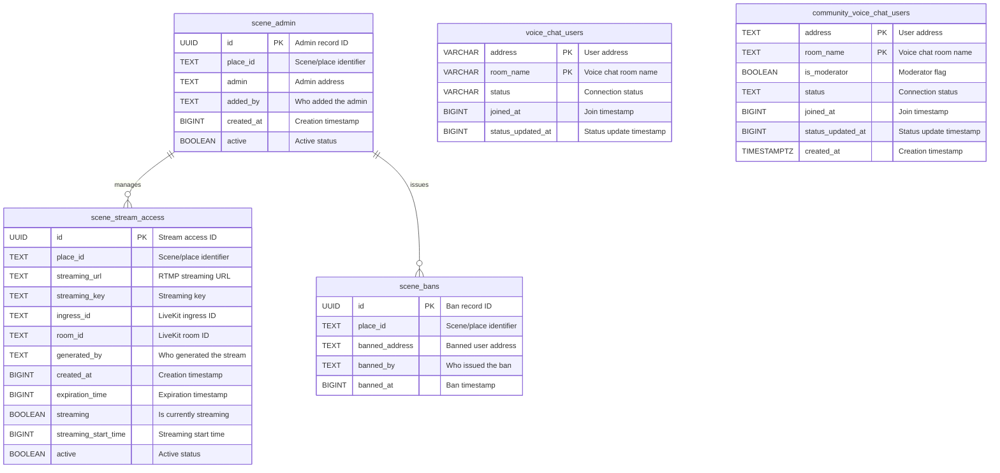

# Database Schema Documentation

This document describes the database schema for the Comms Gatekeeper service. The schema uses PostgreSQL and is managed through migrations located in `src/migrations/`.

## Database Schema Diagram

## Tables Overview

The database contains the following tables:

1. **`scene_admin`** - Stores scene administrators who can manage scenes
2. **`scene_stream_access`** - Manages RTMP streaming URLs and keys for content creators
3. **`scene_bans`** - Tracks users banned from specific scenes
4. **`voice_chat_users`** - Tracks participants in private voice chat rooms
5. **`community_voice_chat_users`** - Tracks participants in community voice chat rooms with moderation

## Table: `scene_admin`

Stores scene administrators who have management privileges for specific scenes.

### Columns

| Column | Type | Nullable | Description |
|--------|------|----------|-------------|
| `id` | UUID | NOT NULL | **Primary Key**. Unique admin record identifier. |
| `place_id` | TEXT | NOT NULL | Scene/place identifier. |
| `admin` | TEXT | NOT NULL | Ethereum address of the admin. |
| `added_by` | TEXT | NOT NULL | Ethereum address of who added this admin. |
| `created_at` | BIGINT | NOT NULL | Timestamp (in milliseconds) when the admin was added. |
| `active` | BOOLEAN | NOT NULL | Active status. Defaults to `true`. |

### Indexes

- **Primary Key**: `id`
- **Unique Index**: `unique_active_scene_admin_place_id_admin` on `(place_id, admin)` where `active = true` - Ensures one active admin per place_id/admin combination

### Business Rules

1. Only one active admin record per place_id/admin combination
2. Inactive admins can be reactivated by setting `active = true`
3. Timestamps stored in milliseconds (BIGINT)

---

## Table: `scene_stream_access`

Manages RTMP streaming URLs and keys for content creators to broadcast to scenes.

### Columns

| Column | Type | Nullable | Description |
|--------|------|----------|-------------|
| `id` | UUID | NOT NULL | **Primary Key**. Unique stream access identifier. |
| `place_id` | TEXT | NOT NULL | Scene/place identifier. |
| `streaming_url` | TEXT | NOT NULL | RTMP streaming URL for the stream. |
| `streaming_key` | TEXT | NOT NULL | Streaming key for authentication. |
| `ingress_id` | TEXT | NOT NULL | LiveKit ingress ID (can be empty for Cast 2.0). |
| `room_id` | TEXT | NULL | LiveKit room ID (e.g., `scene:realm:sceneId`). |
| `generated_by` | TEXT | NULL | Ethereum address of who generated the stream link. |
| `created_at` | BIGINT | NOT NULL | Timestamp (in milliseconds) when the stream access was created. |
| `expiration_time` | BIGINT | NULL | Timestamp (in milliseconds) when the stream access expires. |
| `streaming` | BOOLEAN | NOT NULL | Whether the stream is currently active. Defaults to `false`. |
| `streaming_start_time` | BIGINT | NULL | Timestamp (in milliseconds) when streaming started. |
| `active` | BOOLEAN | NOT NULL | Active status. Defaults to `true`. |

### Indexes

- **Primary Key**: `id`
- **Unique Index**: `unique_active_scene_stream_access_place_id` on `(place_id, active)` where `active = true` - One active stream per place
- **Index**: `idx_scene_stream_access_room_id` on `room_id` - For LiveKit room lookups
- **Index**: `idx_scene_stream_access_generated_by` on `generated_by` - For tracking who generated streams
- **Index**: `idx_scene_stream_access_expiration_time` on `expiration_time` - For cleanup queries
- **Index**: `idx_scene_stream_access_streaming_key` on `streaming_key` - For key lookups

### Business Rules

1. Only one active stream access record per place_id
2. `ingress_id` can be empty for Cast 2.0 (WebRTC) streams
3. `room_id` stores the LiveKit room identifier for direct lookups
4. Streams can have expiration times for automatic cleanup
5. `streaming` flag tracks whether the stream is currently active
6. Timestamps stored in milliseconds (BIGINT)

---

## Table: `scene_bans`

Tracks users who have been banned from specific scenes.

### Columns

| Column | Type | Nullable | Description |
|--------|------|----------|-------------|
| `id` | UUID | NOT NULL | **Primary Key**. Unique ban record identifier. |
| `place_id` | TEXT | NOT NULL | Scene/place identifier. |
| `banned_address` | TEXT | NOT NULL | Ethereum address of the banned user. |
| `banned_by` | TEXT | NOT NULL | Ethereum address of who issued the ban. |
| `banned_at` | BIGINT | NOT NULL | Timestamp (in milliseconds) when the ban was issued. |

### Indexes

- **Primary Key**: `id`
- **Unique Index**: `unique_scene_bans_place_id_banned_address` on `(place_id, banned_address)` - One ban record per user per scene

### Business Rules

1. One ban record per user per scene
2. Bans are permanent (no expiration or active flag)
3. Timestamps stored in milliseconds (BIGINT)

---

## Table: `voice_chat_users`

Tracks participants in private voice chat rooms.

### Columns

| Column | Type | Nullable | Description |
|--------|------|----------|-------------|
| `address` | VARCHAR(42) | NOT NULL | **Primary Key (part 1)**. Ethereum address of the user. |
| `room_name` | VARCHAR | NOT NULL | **Primary Key (part 2)**. Voice chat room name. |
| `status` | VARCHAR | NOT NULL | Connection status: `'connected'`, `'connection_interrupted'`, or `'disconnected'`. |
| `joined_at` | BIGINT | NOT NULL | Timestamp (in milliseconds) when the user joined. |
| `status_updated_at` | BIGINT | NOT NULL | Timestamp (in milliseconds) when the status was last updated. |

### Indexes

- **Composite Primary Key**: `(address, room_name)` - One user per room
- **Index**: `room_name` - For efficient room queries
- **Index**: `idx_voice_chat_users_status_joined_at_status_updated_at` on `(status, joined_at, status_updated_at)` - For cleanup and status queries

### Business Rules

1. One user record per room (composite primary key)
2. Status values: `'connected'`, `'connection_interrupted'`, `'disconnected'`
3. Timestamps stored in milliseconds (BIGINT)

---

## Table: `community_voice_chat_users`

Tracks participants in community voice chat rooms with moderation capabilities.

### Columns

| Column | Type | Nullable | Description |
|--------|------|----------|-------------|
| `address` | TEXT | NOT NULL | **Primary Key (part 1)**. Ethereum address of the user. |
| `room_name` | TEXT | NOT NULL | **Primary Key (part 2)**. Voice chat room name. |
| `is_moderator` | BOOLEAN | NOT NULL | Whether the user is a moderator. Defaults to `false`. |
| `status` | TEXT | NOT NULL | Connection status: `'connected'`, `'connection_interrupted'`, `'disconnected'`, or `'not_connected'`. |
| `joined_at` | BIGINT | NOT NULL | Timestamp (in milliseconds) when the user joined. |
| `status_updated_at` | BIGINT | NOT NULL | Timestamp (in milliseconds) when the status was last updated. |
| `created_at` | TIMESTAMPTZ | NOT NULL | Timestamp when the record was created. Defaults to `now()`. |

### Indexes

- **Composite Primary Key**: `(address, room_name)` - One user per room
- **Index**: `room_name` - For efficient room queries
- **Index**: `(room_name, is_moderator)` - For moderator queries
- **Index**: `(status, status_updated_at)` - For cleanup jobs and status-based queries

### Constraints

- **Check Constraint**: `status IN ('connected', 'connection_interrupted', 'disconnected', 'not_connected')`

### Business Rules

1. One user record per room (composite primary key)
2. Status values: `'connected'`, `'connection_interrupted'`, `'disconnected'`, `'not_connected'`
3. Moderators can manage speakers and requests-to-speak
4. Timestamps stored in milliseconds (BIGINT) for `joined_at` and `status_updated_at`
5. `created_at` uses TIMESTAMPTZ for debugging purposes

---

## Related Code

- **Migrations**: `src/migrations/`
- **Database Adapters**: `src/adapters/db/`
- **Types**: `src/types/`

